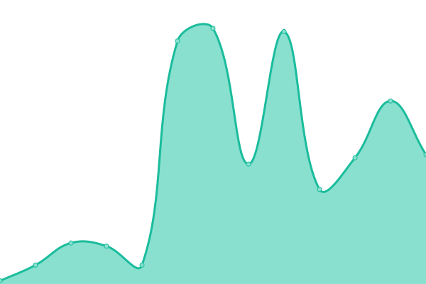
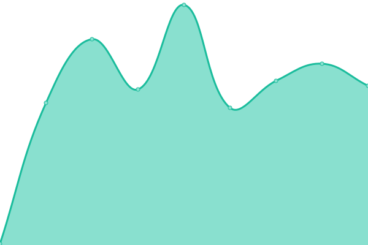
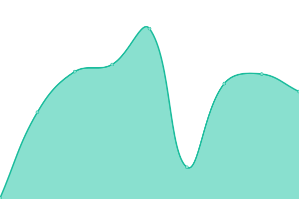
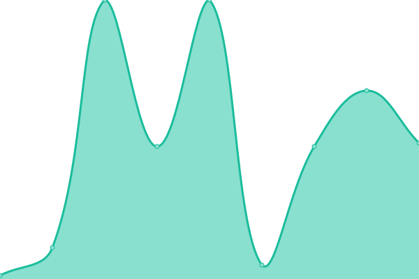
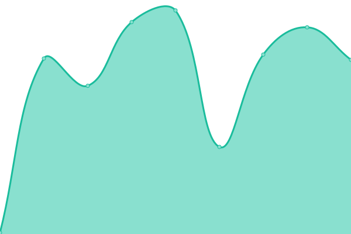
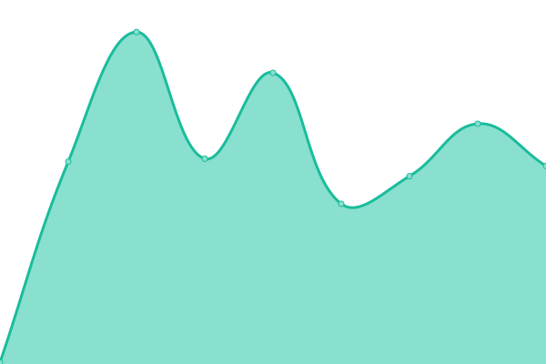

# [📈 Live Status](https://QRjet.github.io/monitor-dev): <!--live status--> **🟧 Partial outage**

This repository contains the open-source uptime monitor and status page for [QRjet](https://QRjet.github.io/monitor-dev), powered by [Upptime](https://github.com/upptime/upptime).

With [Upptime](https://upptime.js.org), you can get your own unlimited and free uptime monitor and status page, powered entirely by a GitHub repository. We use [Issues](https://github.com/QRjet/monitor-dev/issues) as incident reports, [Actions](https://github.com/QRjet/monitor-dev/actions) as uptime monitors, and [Pages](https://QRjet.github.io/monitor-dev) for the status page.

<!--start: status pages-->
<!-- This summary is generated by Upptime (https://github.com/upptime/upptime) -->
<!-- Do not edit this manually, your changes will be overwritten -->
<!-- prettier-ignore -->
| URL | Status | History | Response Time | Uptime |
| --- | ------ | ------- | ------------- | ------ |
|  [[Web - Dev ] Consumer Web App](https://consumer.dev.truetale.io/) | 🟩 Up | [web-dev-consumer-web-app.yml](https://github.com/QRjet/monitor-dev/commits/HEAD/history/web-dev-consumer-web-app.yml) | 

 145ms
     
 | 

<a href="https://QRjet.github.io/monitor-dev/history/web-dev-consumer-web-app">100.00%</a>
    

|  [[ Web - Dev ] Admin Web App](https://admin.dev.truetale.io/) | 🟩 Up | [web-dev-admin-web-app.yml](https://github.com/QRjet/monitor-dev/commits/HEAD/history/web-dev-admin-web-app.yml) | 

 151ms
     
 | 

<a href="https://QRjet.github.io/monitor-dev/history/web-dev-admin-web-app">100.00%</a>
    

|  [[ Web - Dev ] Partner Web App](https://partner.dev.truetale.io/) | 🟩 Up | [web-dev-partner-web-app.yml](https://github.com/QRjet/monitor-dev/commits/HEAD/history/web-dev-partner-web-app.yml) | 

 186ms
     
 | 

<a href="https://QRjet.github.io/monitor-dev/history/web-dev-partner-web-app">100.00%</a>
    

|  [[ Web - Dev ] Brands Web App](https://business.dev.truetale.io/) | 🟩 Up | [web-dev-brands-web-app.yml](https://github.com/QRjet/monitor-dev/commits/HEAD/history/web-dev-brands-web-app.yml) | 

 111ms
     
 | 

<a href="https://QRjet.github.io/monitor-dev/history/web-dev-brands-web-app">100.00%</a>
    

|  [[ Service - Dev ] Billing Service](https://api.dev.truetale.io/api/billing/health-check) | 🟩 Up | [service-dev-billing-service.yml](https://github.com/QRjet/monitor-dev/commits/HEAD/history/service-dev-billing-service.yml) | 

 243ms
     
 | 

<a href="https://QRjet.github.io/monitor-dev/history/service-dev-billing-service">62.79%</a>
    

|  [[ Service - Dev ] Consumer Service](https://api.dev.truetale.io/api/consumer/health-check) | 🟩 Up | [service-dev-consumer-service.yml](https://github.com/QRjet/monitor-dev/commits/HEAD/history/service-dev-consumer-service.yml) | 

 99ms
     
 | 

<a href="https://QRjet.github.io/monitor-dev/history/service-dev-consumer-service">62.79%</a>
    

|  [[ Service - Dev ] Emails Service](https://api.dev.truetale.io/api/emails/health-check) | 🟥 Down | [service-dev-emails-service.yml](https://github.com/QRjet/monitor-dev/commits/HEAD/history/service-dev-emails-service.yml) | 

 38ms
     
 | 

<a href="https://QRjet.github.io/monitor-dev/history/service-dev-emails-service">0.00%</a>
    

|  [[ Service - Dev ] Gateway Service](https://api.dev.truetale.io/graphql/health-check) | 🟩 Up | [service-dev-gateway-service.yml](https://github.com/QRjet/monitor-dev/commits/HEAD/history/service-dev-gateway-service.yml) | 

 35ms
     
 | 

<a href="https://QRjet.github.io/monitor-dev/history/service-dev-gateway-service">61.76%</a>
    

|  [[ Service - Dev ] Media Service](https://api.dev.truetale.io/api/media/health-check) | 🟩 Up | [service-dev-media-service.yml](https://github.com/QRjet/monitor-dev/commits/HEAD/history/service-dev-media-service.yml) | 

 118ms
     
 | 

<a href="https://QRjet.github.io/monitor-dev/history/service-dev-media-service">61.78%</a>
    

|  [[ Service - Dev ] Orders Service](https://api.dev.truetale.io/api/orders/health-check) | 🟩 Up | [service-dev-orders-service.yml](https://github.com/QRjet/monitor-dev/commits/HEAD/history/service-dev-orders-service.yml) | 

 120ms
     
 | 

<a href="https://QRjet.github.io/monitor-dev/history/service-dev-orders-service">61.99%</a>
    

|  [[ Service - Dev ] orgAccounts Service](https://api.dev.truetale.io/api/org-accounts/health-check) | 🟩 Up | [service-dev-org-accounts-service.yml](https://github.com/QRjet/monitor-dev/commits/HEAD/history/service-dev-org-accounts-service.yml) | 

 96ms
     
 | 

<a href="https://QRjet.github.io/monitor-dev/history/service-dev-org-accounts-service">62.59%</a>
    

|  [[ Service - Dev ] Pim Service](https://api.dev.truetale.io/api/pim/health-check) | 🟩 Up | [service-dev-pim-service.yml](https://github.com/QRjet/monitor-dev/commits/HEAD/history/service-dev-pim-service.yml) | 

 110ms
     
 | 

<a href="https://QRjet.github.io/monitor-dev/history/service-dev-pim-service">62.41%</a>
    

|  [[ Service - Dev ] Qr Codes Service](https://api.dev.truetale.io/api/qr-codes/health-check) | 🟩 Up | [service-dev-qr-codes-service.yml](https://github.com/QRjet/monitor-dev/commits/HEAD/history/service-dev-qr-codes-service.yml) | 

 37ms
     
 | 

<a href="https://QRjet.github.io/monitor-dev/history/service-dev-qr-codes-service">62.40%</a>
    

|  [[ Service - Dev ] Reseller Service](https://api.dev.truetale.io/api/reseller/health-check) | 🟩 Up | [service-dev-reseller-service.yml](https://github.com/QRjet/monitor-dev/commits/HEAD/history/service-dev-reseller-service.yml) | 

 108ms
     
 | 

<a href="https://QRjet.github.io/monitor-dev/history/service-dev-reseller-service">62.28%</a>
    

|  [[ Service - Dev ] Shopify Listener Service](https://api.dev.truetale.io/api/shopify-adapter-event-listener/health-check) | 🟩 Up | [service-dev-shopify-listener-service.yml](https://github.com/QRjet/monitor-dev/commits/HEAD/history/service-dev-shopify-listener-service.yml) | 

 38ms
     
 | 

<a href="https://QRjet.github.io/monitor-dev/history/service-dev-shopify-listener-service">61.98%</a>
    

|  [[ Service - Dev ] Shopify Sync](https://api.dev.truetale.io/api/shopify-adapter-sync/health-check) | 🟩 Up | [service-dev-shopify-sync.yml](https://github.com/QRjet/monitor-dev/commits/HEAD/history/service-dev-shopify-sync.yml) | 

 99ms
     
 | 

<a href="https://QRjet.github.io/monitor-dev/history/service-dev-shopify-sync">61.98%</a>
    

|  [[ Service - Dev ] Tags](https://api.dev.truetale.io/api/tags/health-check) | 🟩 Up | [service-dev-tags.yml](https://github.com/QRjet/monitor-dev/commits/HEAD/history/service-dev-tags.yml) | 

 113ms
     
 | 

<a href="https://QRjet.github.io/monitor-dev/history/service-dev-tags">61.30%</a>
    

|  [[ Service - Dev ] Templates](https://api.dev.truetale.io/api/templates/health-check) | 🟩 Up | [service-dev-templates.yml](https://github.com/QRjet/monitor-dev/commits/HEAD/history/service-dev-templates.yml) | 

 118ms
     
 | 

<a href="https://QRjet.github.io/monitor-dev/history/service-dev-templates">61.70%</a>
    

|  [[ Service - Dev ] Widgets](https://api.dev.truetale.io/api/widgets/health-check) | 🟩 Up | [service-dev-widgets.yml](https://github.com/QRjet/monitor-dev/commits/HEAD/history/service-dev-widgets.yml) | 

 97ms
     
 | 

<a href="https://QRjet.github.io/monitor-dev/history/service-dev-widgets">61.76%</a>
    

|  [[ Service - Dev ] Admin](https://api.dev.truetale.io/api/admin/health-check) | 🟩 Up | [service-dev-admin.yml](https://github.com/QRjet/monitor-dev/commits/HEAD/history/service-dev-admin.yml) | 

 109ms
     
 | 

<a href="https://QRjet.github.io/monitor-dev/history/service-dev-admin">62.96%</a>
    

<!--end: status pages-->

[**Visit our status website →**](https://QRjet.github.io/monitor-dev)

## 📄 License

- Powered by: [Upptime](https://github.com/upptime/upptime)
- Code: [MIT](./LICENSE) © [QRjet](https://QRjet.github.io/monitor-dev)
- Data in the `./history` directory: [Open Database License](https://opendatacommons.org/licenses/odbl/1-0/)
